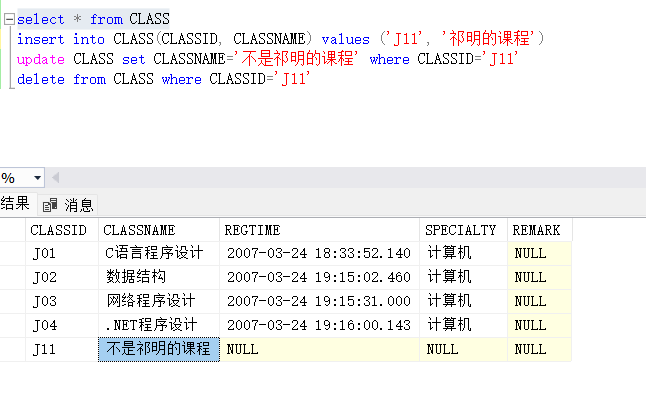
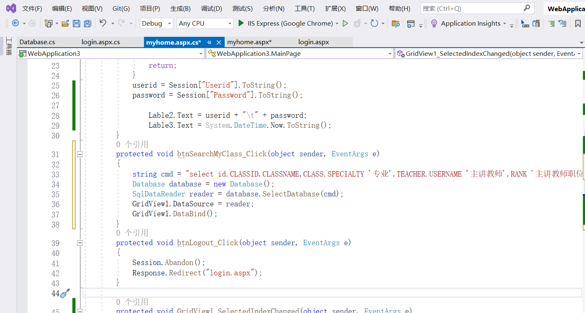

# 一、实验目的

1. 熟悉 Visual Studio 开发环境，学会使用VS创建网站基本结构
2. 熟悉HTML服务器控件，特别是FORM表单服务器空间的设置
3. 掌握表单的处理方法
4. 掌握服务器内置对象：Request、Response、Session等内置对象的使用
5. 掌握ASP.NET日期时间类
6.  掌握在 MS SQL 创建数据库、数据表，并能使用 SQL 语句进行表操作（SELECT、INSERT、UPDATE、DELETE）
7. 掌握 Web.config 文件中变量的创建与读写
8.  掌握 ADO.NET 提供的连接式数据访问方式，了解非连接式数据访问方式
9. 掌握数据源 Web 服务器控件，数据 Web 服务器控件

# 二、实验环境、

- Windows 11 22000.1335
- Visual Studio 2022(C#)
- Microsoft SQL Server 2019

# 三、实验内容

1. 获取与表单用户名、密码后，在注册数据库中验证成功，则在`myhome`页面显示当前用户的私有数据；否则，提示请输入正确的用户名、密码。
2. 使用`GridView`等控件，增强数据的显示与编辑，在`myhome.aspx`页面中，添加控件`GridView1`，合理设计与编辑控件的功能并将简短美观相关技术应用到实验页面中，特别是前端技术显示。

# 四、原理实验步骤

1. 通过VS创建空ASP.NET网站。添加2个WEB窗体：`login.aspx`和`myhome.aspx`


2. 添加新项Visual C# Web窗体：`login.aspx`。

   1. 设置窗体Title为登录页

   2. 在`login.aspx`中，使用`工具箱->标准`，添加3个Lable、2个TextBox和2个Button控件

   3. 设置控件属性

      - ID: Lable1, Lable2, Lable3, txtUserName, txtPwd, btnLogin, btnReset
      - 设置Lable1标签Text属性分别为：用户名、密码、请输入用户名密码
      - 设置Button按钮的Text分别为：登录、重写

      

   4. 设置Button控件Click事件响应函数

      - btnLogin的Click事件：

        - 获取TextBox控件txtUserName、txtPwd的输入值
        - 检查txtUserName、txtPwd的值是否为合法用户，设置用户名为“祁明”，密码为“2020216774”，如果是的话，则创建Session变量保存当前的用户名与密码，再重定向到`myhome.aspx`；否则的话，将Lable3的Text属性设置为：“请输入正确的用户名与密码！”

      - btnReset的Click事件：将TextBox控件txtUserName、txtPwd清空。

   

3. 添加新项Visual C# Web窗体：`myhome.aspx`。

   1. 设置窗体Title为：我的空间

   2. 在myhome.aspx中，使用工具箱->标准：添加3个Lable、1个Button

   3. 设置控件属性

      - ID: Lable1, Lable2, Lable3, btnLogout

      - 设置3个Lable标签的Text属性分别为：欢迎您来到您的空间！、空白、空白。

      - 设置Button的Text属性为：退出。

    

   4. 在myhome.aspx.cs的Page_Load响应函数中：

      1. 通过Session变量，验证当前用户是否已经登录，如未登录则重定向至`login.aspx`。
      2. 设置Lable2.Text值为：当前用户名和密码，即Session中保存的用户名和密码。
      3. 设置Lable3.Text值为：输出当前系统时间。

   5. 设置btnLogout的Click响应函数：
      - 退出当前Session
      - 重定向到Login.aspx窗体

    

4. DBMS系统熟悉与使用

   1. SQL Server Management Studio及其相关使用

      启动SQL Server的SQL Server Management Studio，登录成功后，右键单击数据库附加NetSchool数据库，查看其中的STUDENT/STUDENT_CLASS表。

      

      

      

      例如查询CLASS表进行操作：

      ```mssql
      select * from CLASS
      ```

      

      ```mssql
      insert into CLASS(CLASSID, CLASSNAME) values ('J11', '祁明的课程')
      ```

      

      ```mssql
      update CLASS set CLASSNAME='不是祁明的课程' where CLASSID='J11'
      ```

      
      
      ```mssql
      delete from CLASS where CLASSID='J11'
      ```
      
      

   2. 用户名密码的验证

      

5. 变更登录验证方式为数据库索引验证方式

   

6. 在 myhome.aspx 页面中添加 ListBox 控件、Button 控件

    - 修改 Button 控件：ID 为：btnSeachMyclass。Text 属性：查询
    - 修改 ListBox 控件：ID 为：ListBMyClass。在 Page_Load 中，通过程序对其初始化，添加一个 Item 项目“我所选修的课程”
    - 在对应的 btnSeachMyclass_Click函数中进行编码，当点击该按钮后，将当 前登录用户的所有选修课程的 ClassID 以 Item 的方式显示在 ListBox 控件中


# 五、关键问题及解决方法

1. 设置TextBox控件使其显示当前系统时间：

   首先可以知道以下代码可以一次性显示调用时的日期时间。

   ```c#
   Lable3.Text = System.DateTime.Now.ToString();
   ```

   如果要实现时间的刷新，则还需要其他的方式来实现。

   首先考虑多线程实现。添加函数使其每秒钟重新获取当前时间。

   ```c#
   private void showCurrentLocalTime()
   {
       while (true)
       {
           Lable3.Text = System.DateTime.Now.ToString();
           Thread.Sleep(1000);
       }
   }
   ```

   然后在Load_Page中调用并创建线程。

   ```c#
   Thread thread = new Thread(() => showCurrentLocalTime());
   thread.Start();
   ```

   运行后结果如下，可以看到调试中确实实现了每秒钟获取一次时间值，但可以看到网页中并没有同步更新时间，说明这样做不足以完成动态刷新时间的目的。

   
   
   通过查阅资料后发现，ASP中有控件updatePanel和控件Timer可以完成按时间刷新的功能，因此修改代码如下：
   
   
   
   ```asp
   <asp:Label runat="server" Text="欢迎来到您的空间" id="Lable1"></asp:Label><br />
   <asp:Label runat="server" Text="" id="Lable2"></asp:Label><br />
   <asp:ScriptManager ID="ScriptManager1" runat="server"></asp:ScriptManager>
   <asp:UpdatePanel ID="UpdatePanel1" runat="server">
       <ContentTemplate>
           <asp:Label runat="server" Text="" id="Lable3"></asp:Label><br />
           <asp:Timer ID="Timer1" runat="server" Interval="1000"></asp:Timer>
       </ContentTemplate>
   </asp:UpdatePanel>
   <asp:Button runat="server" Text="退出" id="btnLogout" OnClick="btnLogout_Click"></asp:Button><br />
   ```
   
   验证是否成功。为了显示系统当前时间方便对照，编写shell脚本如下：

    ```shell
    while true
    do
            time=$(date "+%Y-%m-%d %H:%M:%S")
            echo $time
            sleep 1
            clear
    done
    ```

    

    运行ASP项目，可以发现时间已经在动态变化了，并且对比shell输出的当前时间可以发现结果一致，证明修改成功。


2. 修改登录认证方式为数据库索引验证方式

   1. 首先添加数据库登录验证的账户，避免超级管理员登录数据库

      

   2. 设置登录属性使该用户可以连接到数据库

      

   3. 为使代码可以复用，添加一个专门连接并查询数据库的类`Database`

       ```c#
       public class Database
       {
           private SqlConnection connection;
       
           public void OpenDatabase()
           {
               if (connection == null)
               {
                   // 连接数据库
                   connection = new SqlConnection("data Source=(local);database=NetSchool;user id=qiming;pwd=123456");
               }
               if (connection.State == System.Data.ConnectionState.Closed)
               {
                   try
                   {
                       connection.Open();
                   }
                   catch (Exception ex)
                   {
                       throw new Exception(ex.Message, ex);
                   }
               }
           }
       
           public void CloseDatabase()
           {
               if (connection != null)
               {
                   if (connection.State == System.Data.ConnectionState.Open)
                       connection.Close();
               }
           }
       
           /// <summary>
           /// 运行SELECT语句，将查询结果以SqlDataReader对象返回
           /// </summary>
           /// <param name="sqlCmd">sql command text</param>
           /// <returns>SqlDataReader Object</returns>
           /// <exception cref="Exception"></exception>
           public SqlDataReader SelectDatabase(string sqlCmd)
           {
               OpenDatabase();
               SqlCommand command = new SqlCommand(sqlCmd, connection);
               SqlDataReader sqlDataReader = null;
               try
               {
                   sqlDataReader = command.ExecuteReader(System.Data.CommandBehavior.CloseConnection);
               }
               catch (SqlException ex)
               {
                   throw new Exception(ex.Message, ex); 
               }
               return sqlDataReader;
           }
       }
       ```

   4. 修改登录按钮的时间处理函数如下：

       ```c#
       protected void btnLogin_Click(object sender, EventArgs e)
       {
           string username = txtUserName.Text;
           string pwd = txtPwd.Text;
           string cmd = "select * from STUDENT where USERID = '" + username + "' and PASSWORD = '" + pwd + "'";
           Database database = new Database();
           SqlDataReader reader = database.SelectDatabase(cmd);
           if (reader.Read())
           {
               Session["UserId"] = Server.HtmlEncode(username);
               Session["Password"] = Server.HtmlEncode(pwd);
               Response.Redirect("myhome.aspx");
           }
           else
           {
               txtUserName.Text = null; txtPwd.Text = null;
               Lable3.Text = "请输入正确的用户名与密码！";
               Lable3.ForeColor = Color.Red;
           }
       }
       ```

   5. 打开SQL Server服务端，运行项目检查登录情况

       1. 首先测试错误的用户名和密码检验

           

       2. 输入可以登录的用户名密码，测试可以正常跳转到`myhome`页面。

   6. 检查特殊的用户名能否通过登录

       1. 首先测试如下用户名登录情况，可以发现带有bool类型的用户名会被ASP服务器识别并报错。

           

       2. 将用户名中的true为布尔表达式`1=1`，可以看到此时绕过了密码登录进入了myhome页面。

           

   7. 修改Login.aspx.cs使其阻止SQL注入

       [Microsoft Learn SQL docs]: https://learn.microsoft.com/en-us/SQL/relational-databases/security/sql-injection?view=sql-server-ver16	"SQL 注入"

       > SQL injection is an attack in which malicious code is inserted into strings that are later passed to an instance of SQL Server for parsing and execution. Any procedure that constructs SQL statements should be reviewed for injection vulnerabilities because SQL Server will execute all syntactically valid queries that it receives. Even parameterized data can be manipulated by a skilled and determined attacker.

       一种解决办法是始终通过测试类型、长度、格式和范围来验证用户输入。或者不直接使用用户的输入生成SQL语句。

       一般简单的SQL注入会包含以下字符，因此可以检查用户输入中是否包含这些字符。

       |      输入字符      |                   在 Transact-SQL 中的含义                   |
       | :----------------: | :----------------------------------------------------------: |
       |       **;**        |                         查询分隔符。                         |
       |       **'**        |                    字符数据字符串分隔符。                    |
       |       **--**       | 单行注释分隔符。 服务器不计算在 **--** 之后直到该行结束的文本。 |
       | **/\*** ... ***/** |  注释分隔符。 服务器不计位于 **/\*** 和 ***/** 之间的文本。  |
       |      **xp_**       |     用于目录扩展存储过程的名称的开头，如 `xp_cmdshell`。     |

       添加如下方法检查用户名合法性：

       ```c#
       private bool IsValid(string username)
       {
           if (username.Contains("'") || username.Contains(";") || username.Contains("--") || username.Contains("/*") || username.Contains("xp_"))
               return false;
           else
               return true;
       }
       ```

       然后在登录点击按钮事件中调用该方法，如果用户名非法则直接返回用户名密码错误。

       修改if语句为`if (IsValid(username) && reader.Read())`

   8. 再次检查上述用户名是否可以登录

       

       可以看到此时已经无法使用该用户名进行SQL注入。

       

3. 使用 GridView 等控件，增强数据的显示与编辑

    在 myhome.aspx 页面中，添加控件 GridView1，并根据自己对本门课程中，对数据源服务器控件、数据绑定等掌握情况，合理地设计与编辑 GridView 控件的功能。

    上面ListBox控件仅能展示有限的信息，如果需要展示完整的表格，则需要GridView控件。

    设计显示查询出CLASSID、课程名称、专业、注册时间、主讲教师、职位和成绩信息，由于这些信息分布在四个表中，设计SQL语句多表查询：

    ```sql
    select id.CLASSID,CLASSNAME,CLASS.SPECIALTY,TEACHER.USERNAME "主讲教师",RANK "主讲教师职位",REGTIME "注册时间",GRADE 
    from (select CLASSID,GRADE FROM STUDENT_CLASS where USERID='201') as id
    inner join CLASS on id.CLASSID=CLASS.CLASSID
    inner join TEACHER_CLASS on id.CLASSID=TEACHER_CLASS.CLASSID and DUTY='主讲教师'
    inner join TEACHER on TEACHER_CLASS.USERID=TEACHER.USERID
    order by id.CLASSID;
    ```

    
    
    可以看到查询正确返回了结果。
    
    在myhome.aspx中编辑GridView控件：

    

    修改查询按钮事件函数如下：

    ```c#
    protected void btnSearchMyClass_Click(object sender, EventArgs e)
    {
        string cmd = "select id.CLASSID,CLASSNAME,CLASS.SPECIALTY '专业',TEACHER.USERNAME '主讲教师',RANK '主讲教师职位',REGTIME '注册时间',GRADE from (select CLASSID,GRADE FROM STUDENT_CLASS where USERID='" + userid + "') as id inner join CLASS on id.CLASSID=CLASS.CLASSID inner join TEACHER_CLASS on id.CLASSID=TEACHER_CLASS.CLASSID and DUTY='主讲教师' inner join TEACHER on TEACHER_CLASS.USERID=TEACHER.USERID order by id.CLASSID";
        Database database = new Database();
        SqlDataReader reader = database.SelectDatabase(cmd);
        GridView1.DataSource = reader;
        GridView1.DataBind();
    }
    ```
    
    
    
    
    
    验证查询结果：
    
    

# 六、实验结果

1. 实验二

   

   

    

使用Bootstrap美化登录页面


    


2. 实验三：


# 七、实验体会


